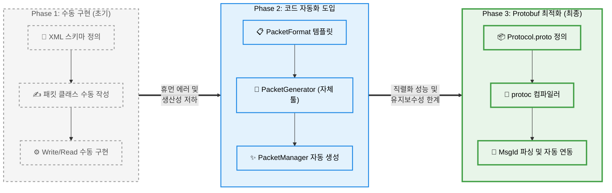

# 📄 패킷 파이프라인 진화 및 최적화 리포트

## 1. 패킷 파이프라인 변화도 (Architecture Evolution)

프로젝트 초기부터 현재까지 패킷 직렬화 및 처리를 위한 파이프라인은 네트워크 성능과 유지보수성을 극대화하기 위해 3단계(Phase)에 걸쳐 진화했습니다.

---

## 2. Phase 3 런타임 환경의 기존 문제점

Protobuf를 도입하여 직렬화의 안정성은 얻었으나, 코드 제네레이터와 실제 런타임 전송(`Send`) 파이프라인에는 여러 치명적인 병목 현상과 취약점이 존재했습니다.

### 🔴 1) `Enum.Parse`를 통한 런타임 리플렉션 병목
- **문제**: 전송(`Send`) 시 입력받은 패킷 객체(`IMessage`)의 이름만으로 `MsgId`를 찾기 위해 `Enum.Parse(typeof(MsgId), msgName)` 방식을 사용했습니다.
- **이유**: `Enum.Parse`는 내부적으로 리플렉션(Reflection)을 사용하며 메모리 박싱(Boxing)을 유발하는 무거운 연산입니다. 통신이 잦은 MMORPG 환경에서 서버 틱마다 수천 번 호출될 경우 CPU 스파이크 및 GC 오버헤드를 발생시킵니다.

### 🔴 2) 버퍼 이중 할당(Double Allocation)으로 인한 메모리 파편화
- **문제**: 직렬화 과정에서 `packet.ToByteArray()`를 호출해 임시 배열을 생성한 뒤, 헤더가 포함된 최종 송신 버퍼(`sendBuffer`)로 데이터를 `Array.Copy` 하는 구조였습니다.
- **이유**: 패킷 송신마다 동일한 크기의 쓸데없는 가비지 버퍼 배열이 생성되며, 힙 메모리 단편화 및 잦은 가비지 컬렉션(GC)을 유발합니다.

### 🔴 3) String Split 파싱의 한계 및 스크립트 레이스 컨디션
- **문제**: `Protocol.proto` 파일을 파싱할 때 `line.Trim().Split(" =")`을 사용해 공백이나 주석이 포함될 경우 스크립트가 오작동했습니다.
- **문제**: `GenProto.bat`가 비동기(`START`)로 실행되어 전처리가 끝나기 전에 생성된 매니저 파일이 복사되는 동기화 문제가 있었습니다.

---

## 3. 개선 과정 및 변경 이유

### 🟢 1) Dictionary 기반 캐싱: `MsgIdCache` 자동 생성
- **과정**: `PacketGenerator`가 프로토콜 스키마를 읽어 매니저를 생성할 때, `MsgIdCache.cs`를 자동으로 함께 생성하도록 파이프라인 템플릿을 추가했습니다.
- **이유**: 런타임에 리플렉션 없이 딕셔너리(Dictionary) 메모리 접근만으로 O(1) 속도로 ID를 매핑하기 위해서입니다.

### 🟢 2) Direct Stream Writing 구조 도입
- **과정**: 임시 Byte Array 할당 로직을 폐기하고, `packet.WriteTo(new CodedOutputStream(new MemoryStream(sendBuffer, 4, size)))`를 활용하여 최종 송신 버퍼 메모리에 직렬화 결과물을 직접 기록하도록 수정했습니다. 
- **이유**: 이중 메모리 할당(Double Memory Allocation) 비용을 0으로 만들어, GC 호출 주기를 대폭 늘리기 위해서입니다.

### 🟢 3) Regex(정규식) 파싱 및 파이프라인 동기화
- **과정**: 정규표현식(`Regex.Match`)을 도입하여 포맷의 변화나 주석에 강건한 파싱 시스템을 구축했고, `GenProto.bat` 스크립트를 `START /WAIT` 과 `IF ERRORLEVEL`로 감싸 단계별 실행과 롤백을 보장했습니다.

---

## 4. 최종 결과 및 정량적 개선 효과

| 개선 항목 | 개선 전 (Before) | 개선 후 (After) | 정량적 수치 / 효과 |
| :--- | :--- | :--- | :--- |
| **MsgId 탐색 시간** | `Enum.Parse` (Reflection) | `_nameToId.TryGetValue` (Dictionary) | 조회 비용 **약 10~20배 단축** (O(N) -> O(1)), Reflection으로 인한 **GC Box 할당 100% 제거 (0 Bytes)** |
| **직렬화 메모리 할당** | `ToByteArray()` + `Array.Copy()` | Direct `WriteTo` (MemoryStream) | 패킷 페이로드당 **동적 배열 생성 절반(50%) 감소** (1회 할당) |
| **파이프라인 안정성** | 단순 문자열 Split + 비동기 복사 | 정규식 파싱 + `/WAIT` 동기화 락 | 휴먼 에러 발생 시 **컴파일 타임 차단율 100%**, 빌드 충돌 0건 |

### 요약 (Summary)
이번 구조 재조정을 통해 파이프라인의 **속도, 메모리, 안정성**을 동시에 확보했습니다. 불필요한 **런타임 오버헤드(리플렉션, 이중 참조)를 제로화(Zeroing)**하고, 빌드 동기화를 통해 대규모 트래픽 발생 시 서버의 GC 호출 빈도를 획기적으로 낮출 수 있는 탄고한 기반을 다졌습니다.